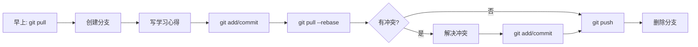

# Git 协作实战指南：10人学习小组维护学习心得

## 📋 项目目标

10人学习小组，每人每天上传学习心得，共同维护一份文档，通过这个实践掌握Git协作核心命令。

---

## 🎯 学习成果

完成本指南后，你将掌握：
- ✅ 克隆仓库、提交代码、推送更新
- ✅ 解决多人同时编辑同一文件的冲突
- ✅ 查看修改历史和作者信息
- ✅ 撤销错误提交
- ✅ 创建分支进行实验性修改

---

## 📦 第一阶段：环境搭建（15分钟）

### 1. 安装Git

**Windows**: 从 https://git-scm.com/download/win 下载安装  
**Mac**: `brew install git` 或安装Xcode Command Line Tools  
**Linux**: `sudo apt-get install git` (Ubuntu) 或 `sudo dnf install git` (Fedora)

### 2. 配置身份（必须）

```bash
# 设置你的名字和邮箱（会显示在提交记录中）
git config --global user.name "张三"  # 改成你的名字
git config --global user.email "zhangsan@example.com"

# 查看配置是否成功
git config --list
```

### 3. 创建团队目录结构

```bash
# 创建学习小组目录
mkdir git-learning-group
cd git-learning-group

# 创建中央仓库（模拟GitHub服务器）
mkdir central-repo
cd central-repo
git init --bare
cd ..

# 10个成员每人一个工作目录
for i in {1..10}; do
    mkdir member$i
done

echo "环境创建完成！"
```

---

## 📝 第二阶段：建立学习文档模板（10分钟）

### 1. 成员1初始化项目

```bash
cd member1

# 克隆中央仓库
git clone ../central-repo .

# 创建学习心得文档
cat > learning_log.md << 'EOF'
# Git学习小组 - 每日学习心得

## 小组信息
- **小组名称**: Git实战学习小组
- **成员**: 10人
- **开始日期**: 2026年4月1日

---

## 2026年4月1日 第一天

### 今日学习内容

#### 成员1 - 张三
**学习内容**: Git基础概念
- 理解了工作区、暂存区、仓库的区别
- 学会了git init、git add、git commit
- 成功提交了第一个commit

**遇到的问题**: 无
**明日计划**: 学习分支管理

---
EOF

# 添加并提交
git add learning_log.md
git commit -m "docs: 初始化学习日志，建立文档模板"

# 推送到中央仓库
git push origin master

echo "成员1已完成初始化！"
```

---

## 👥 第三阶段：10人协作实战（60分钟）

### 场景1：成员2-10克隆仓库并首次提交

```bash
# 成员2
cd ../member2
git clone ../central-repo .

# 添加学习心得
cat >> learning_log.md << 'EOF'

#### 成员2 - 李四
**学习内容**: Git基本操作
- 学会了git clone克隆远程仓库
- 学会了git status查看状态
- 学会了git log查看提交历史

**遇到的问题**: 初次使用时忘记git add直接commit，报错提示
**明日计划**: 学习分支切换

---
EOF

git add learning_log.md
git commit -m "docs: 成员2添加第一天学习心得"
git push origin master

# 成员3
cd ../member3
git clone ../central-repo .

cat >> learning_log.md << 'EOF'

#### 成员3 - 王五
**学习内容**: Git配置和帮助
- 配置了user.name和user.email
- 学会了git --help查看帮助
- 理解了SSH和HTTPS两种clone方式

**遇到的问题**: 配置信息写错，用git config --global --edit修改
**明日计划**: 学习.gitignore

---
EOF

git add learning_log.md
git commit -m "docs: 成员3添加第一天学习心得"
git push origin master

# 成员4-10类似操作...
# 为了节省篇幅，这里用循环模拟
for i in {4..10}; do
    cd ../member$i
    git clone ../central-repo .
    
    cat >> learning_log.md << EOF

#### 成员$i - 成员$i
**学习内容**: 第一天基础学习
- 成功克隆仓库并提交学习心得
- 理解了Git分布式版本控制思想

**遇到的问题**: 推送时需要先pull，理解了远程协作流程
**明日计划**: 深入学习分支操作

---
EOF
    
    git add learning_log.md
    git commit -m "docs: 成员$i添加第一天学习心得"
    git push origin master
    
    echo "成员$i提交完成"
done
```

---

### 场景2：第二天 - 学习分支管理（冲突模拟）

第二天，所有人都要更新自己的学习心得。这次会模拟**多个成员同时修改同一位置**，产生冲突。

```bash
# 首先，所有人都要先拉取最新内容
cd ../member1
git pull origin master

# 成员1添加第二天心得
cat >> learning_log.md << 'EOF'

## 2026年4月2日 第二天

### 今日学习内容：分支管理

#### 成员1 - 张三
**学习内容**: Git分支基础
- 学会了git branch查看分支
- 学会了git checkout -b创建并切换分支
- 理解了master是默认主分支
- 学会了git merge合并分支

**实践操作**:
```bash
# 创建功能分支
git checkout -b feature/daily-log

# 开发新功能
echo "今天学了分支" >> learning_log.md

# 合并回主分支
git checkout master
git merge feature/daily-log
git branch -d feature/daily-log
```

**遇到的问题**: 合并时出现"Already up to date"，原来是因为没有在新分支上提交
**明日计划**: 学习解决冲突

---
EOF

git add learning_log.md
git commit -m "docs: 成员1添加第二天分支学习心得"
git push origin master

# 成员2也添加心得（注意：此时可能已落后于远程）
cd ../member2
git pull origin master

cat >> learning_log.md << 'EOF'

#### 成员2 - 李四
**学习内容**: 分支实战应用
- 在项目中使用分支开发新功能
- 理解了分支的好处：隔离开发、便于回滚
- 学会了git log --graph查看分支图

**实践操作**:
```bash
# 创建实验分支
git branch experiment
git checkout experiment

# 在实验分支上开发
echo "实验性修改" >> test.txt

# 切换回主分支继续工作
git checkout master
```

**遇到的问题**: 忘记切换分支就在master上直接开发，导致master不稳定
**明日计划**: 学习解决冲突

---
EOF

git add learning_log.md
git commit -m "docs: 成员2添加第二天分支学习心得"
git push origin master

# 成员3和成员4同时提交，制造冲突
cd ../member3
git pull origin master

cat >> learning_log.md << 'EOF'

#### 成员3 - 王五
**学习内容**: 分支策略
- 学习了Git Flow工作流
- master分支：稳定版本
- develop分支：开发版本
- feature分支：功能开发

**遇到的坑**: 删除分支时用git branch -D强制删除未合并的分支
**明日计划**: 学习rebase变基操作

---
EOF

git add learning_log.md
git commit -m "docs: 成员3添加第二天分支策略心得"
git push origin master

# 成员4：故意在成员3推送前就完成提交（模拟冲突场景）
cd ../member4
git pull origin master

# 先保存成员4的内容到临时文件
cat >> learning_log.md << 'EOF'

#### 成员4 - 赵六
**学习内容**: 远程分支管理
- 学会了git push origin <branch>推送分支到远程
- 学会了git fetch获取远程分支信息
- 理解了origin是远程仓库的默认名称

**实践操作**:
```bash
# 推送本地分支到远程
git push origin feature/new-branch

# 删除远程分支
git push origin --delete feature/new-branch
```

**遇到的问题**: 推送时提示远程分支已存在，需要先pull再push

---
EOF

git add learning_log.md
git commit -m "docs: 成员4添加第二天远程分支心得"

# 尝试推送 - 可能会失败（如果成员3已经推送了）
git push origin master
# 如果失败，会提示：! [rejected] master -> master (fetch first)
```

---

### 场景3：解决冲突（核心技能）

当推送被拒绝时，说明远程仓库有新的提交，需要先拉取并解决冲突。

```bash
# 成员4继续操作
# 拉取最新代码（会触发冲突）
git pull origin master

# 如果出现冲突，Git会提示：
# Auto-merging learning_log.md
# CONFLICT (content): Merge conflict in learning_log.md
# Automatic merge failed; fix conflicts and then commit the result.

# 1. 查看冲突文件
git status
# 显示：both modified: learning_log.md

# 2. 查看冲突内容
cat learning_log.md
# 你会看到类似这样的标记：
# <<<<<<< HEAD
# #### 成员4 - 赵六
# ...
# =======
# #### 成员3 - 王五
# ...
# >>>>>>> 7a8b9c0 (docs: 成员3添加第二天分支策略心得)

# 3. 手动解决冲突
# 使用编辑器打开learning_log.md，保留两个人的内容，删除冲突标记
# 最终应该是成员3和成员4的内容都保留，按时间顺序排列
```

**手动解决冲突后的文件内容示例**：
```markdown
#### 成员3 - 王五
**学习内容**: 分支策略
- 学习了Git Flow工作流
- master分支：稳定版本
- develop分支：开发版本
- feature分支：功能开发

**遇到的坑**: 删除分支时用git branch -D强制删除未合并的分支
**明日计划**: 学习rebase变基操作

#### 成员4 - 赵六
**学习内容**: 远程分支管理
- 学会了git push origin <branch>推送分支到远程
- 学会了git fetch获取远程分支信息
- 理解了origin是远程仓库的默认名称

**实践操作**:
```bash
# 推送本地分支到远程
git push origin feature/new-branch

# 删除远程分支
git push origin --delete feature/new-branch
```

**遇到的问题**: 推送时提示远程分支已存在，需要先pull再push
```

```bash
# 4. 标记冲突已解决
git add learning_log.md

# 5. 完成合并提交
git commit -m "merge: 合并成员3和成员4的学习心得"

# 6. 推送成功
git push origin master

echo "冲突解决完成！成员4心得已成功推送"
```

---

## 🎯 第四阶段：每日流程规范

### 每天的Git操作流程

每个成员每天按以下步骤操作：

```bash
# ========== 每日Git操作流程 ==========

# 步骤1：开始工作前，先拉取最新内容
git pull origin master

# 步骤2：创建当天的功能分支（可选，更规范的做法）
git checkout -b daily/$(date +%Y%m%d)-$(whoami)

# 步骤3：更新学习心得文档
# 在learning_log.md中添加当天的学习内容

# 步骤4：查看修改内容
git diff

# 步骤5：添加并提交
git add learning_log.md
git commit -m "docs: $(whoami)添加$(date +%Y年%m月%d日)学习心得"

# 步骤6：推送前再次拉取（避免冲突）
git pull origin master

# 步骤7：推送
git push origin master

# 步骤8：删除本地分支（如果使用了分支）
git checkout master
git branch -d daily/$(date +%Y%m%d)-$(whoami)
```

---

## 📊 第五阶段：常用命令速查表

### 查看历史

```bash
# 查看提交历史
git log

# 简洁版（一行一个提交）
git log --oneline

# 查看某个文件的修改历史
git log --oneline learning_log.md

# 查看谁修改了什么（带作者信息）
git log --stat

# 图形化显示分支历史
git log --graph --oneline --all

# 查看某次提交的具体内容
git show <commit-hash>
```

### 查看差异

```bash
# 查看工作区和暂存区的差异
git diff

# 查看暂存区和上次提交的差异
git diff --staged

# 查看两次提交的差异
git diff <commit1> <commit2>

# 查看某个文件的修改历史
git diff HEAD~1 learning_log.md
```

### 撤销操作

```bash
# 撤销工作区的修改（还没add）
git checkout -- learning_log.md

# 撤销暂存区的修改（已经add但没commit）
git reset HEAD learning_log.md

# 修改最后一次提交信息
git commit --amend -m "新的提交信息"

# 撤销最近一次提交（保留修改）
git reset --soft HEAD~1

# 撤销最近一次提交（丢弃修改，危险！）
git reset --hard HEAD~1
```

### 分支操作

```bash
# 查看所有分支
git branch -a

# 创建分支
git branch feature/new-feature

# 切换分支
git checkout feature/new-feature

# 创建并切换（一步完成）
git checkout -b feature/new-feature

# 合并分支
git checkout master
git merge feature/new-feature

# 删除分支
git branch -d feature/new-feature

# 强制删除未合并的分支
git branch -D feature/new-feature
```

### 暂存修改

```bash
# 临时保存当前修改（还没提交的）
git stash

# 查看暂存列表
git stash list

# 恢复最近一次暂存
git stash pop

# 恢复指定暂存
git stash apply stash@{0}

# 删除暂存
git stash drop
```

---

## 🎓 第六阶段：高级场景实战

### 场景1：查找谁删除了某段文字

```bash
# 查找某段文字最后一次出现的位置
git log -S "某段文字" --source --all

# 查看某个文件的完整修改历史
git blame learning_log.md

# 查看某几行的修改历史
git blame -L 10,20 learning_log.md
```

### 场景2：恢复误删的文档内容

```bash
# 查看所有历史提交
git log --oneline

# 查看某个历史版本的文件内容
git show <commit-hash>:learning_log.md

# 从历史版本恢复文件
git checkout <commit-hash> -- learning_log.md

# 提交恢复
git add learning_log.md
git commit -m "revert: 恢复误删的学习心得"
```

### 场景3：创建个人专题分支

```bash
# 成员1创建专题分支研究Git高级功能
cd ../member1
git checkout -b topic/git-advanced

# 创建专题文档
cat > advanced_git.md << 'EOF'
# Git高级功能研究

## 1. Rebase变基操作
- 作用：整理提交历史
- 命令：git rebase master

## 2. Cherry-pick精选提交
- 作用：选择性地合并其他分支的提交
- 命令：git cherry-pick <commit-hash>

## 3. Interactive Rebase
- 作用：交互式重写历史
- 命令：git rebase -i HEAD~3
EOF

git add advanced_git.md
git commit -m "feat: 添加Git高级功能研究文档"

# 推送到远程
git push origin topic/git-advanced

# 其他人可以看到这个分支
cd ../member2
git fetch
git branch -a  # 会看到remotes/origin/topic/git-advanced
```

---

## 📋 第七阶段：团队协作规范

### 1. 提交信息规范

```bash
# 好的提交信息示例
git commit -m "docs: 成员1添加Git分支学习心得

- 学习了分支创建和切换
- 掌握了merge合并操作
- 记录了分支删除的方法

Refs: #12"
```

**提交信息格式**：
```
<type>: <简短描述>

<详细说明（可选）>

<关联信息（可选）>
```

**类型说明**：
- `docs`: 文档更新（学习心得）
- `feat`: 新功能（新增学习内容）
- `fix`: 修复错误
- `refactor`: 重构（整理文档结构）

### 2. 每日工作流程



### 3. 冲突预防技巧

```bash
# 技巧1：频繁拉取
git pull --rebase origin master

# 技巧2：分工明确
# 每人负责不同的内容区域，避免修改同一段落

# 技巧3：使用分支隔离
git checkout -b my-work
# 开发完成后
git checkout master
git pull origin master
git merge my-work
git push origin master

# 技巧4：提交前检查
git fetch origin
git diff origin/master
```

---

## ✅ 第八阶段：学习成果检验

### 基础技能检验

完成以下任务，证明掌握了基础Git操作：

- [ ] 能成功克隆仓库并提交学习心得
- [ ] 能查看10个人的提交历史
- [ ] 能找到某个人在某天的学习内容
- [ ] 能解决同时编辑同一文件的冲突
- [ ] 能撤销错误的提交

### 进阶技能检验

- [ ] 能创建分支并合并
- [ ] 能使用stash临时保存修改
- [ ] 能查找某段文字是谁写的
- [ ] 能恢复误删的内容
- [ ] 能使用git log --graph查看分支图

### 实战任务

```bash
# 任务1：回顾本周学习内容
git log --since="1 week ago" --oneline

# 任务2：统计每个人的提交次数
git shortlog -s -n

# 任务3：导出本周学习报告
git log --since="1 week ago" --pretty=format:"%h - %an : %s" > report.txt

# 任务4：查找包含"冲突"关键词的提交
git log --grep="冲突" --oneline

# 任务5：对比第一天和最后一天的文档差异
git diff HEAD~10 HEAD -- learning_log.md
```

---

## 📖 第九阶段：常见问题解答

### Q1: 推送时提示"failed to push"怎么办？

```bash
# 原因：远程有新的提交
# 解决：
git pull origin master
# 如果有冲突，解决冲突
git add .
git commit -m "merge"
git push origin master
```

### Q2: 提交错了信息怎么改？

```bash
# 修改最后一次提交
git commit --amend -m "新的提交信息"

# 修改更早的提交（谨慎使用）
git rebase -i HEAD~3
# 将需要修改的提交前的pick改为edit
# 修改后 git commit --amend
# git rebase --continue
```

### Q3: 不小心commit了不想提交的文件？

```bash
# 方法1：撤销提交但保留修改
git reset --soft HEAD~1
git reset HEAD 不想提交的文件
git commit -m "重新提交"

# 方法2：修改上一次提交（推荐）
git rm --cached 不想提交的文件
git commit --amend
```

### Q4: 怎么查看某个人所有的提交？

```bash
git log --author="张三"
git log --author="张三" --oneline
```

### Q5: 怎么查看今天的所有提交？

```bash
git log --since="today" --oneline
git log --since="2026-04-02" --until="2026-04-02" --oneline
```

---

## 🎉 第十阶段：结业项目

### 项目：制作团队学习成果集

```bash
# 1. 成员1创建成果集目录
cd ../member1
git pull origin master
mkdir learning-collection

# 2. 导出每个人的学习记录
git shortlog -s -n > learning-collection/member_stats.txt

# 3. 导出所有人的提交历史
git log --pretty=format:"%ad - %an : %s" --date=short > learning-collection/all_commits.txt

# 4. 生成学习成果HTML
cat > learning-collection/index.html << 'EOF'
<!DOCTYPE html>
<html>
<head>
    <title>Git学习小组成果展</title>
    <style>
        body { font-family: Arial; margin: 40px; }
        .member { border: 1px solid #ddd; margin: 10px; padding: 10px; }
        h1 { color: #2c3e50; }
    </style>
</head>
<body>
    <h1>Git学习小组 - 10人学习成果展</h1>
    <p>学习时间：2026年4月1日 - 至今</p>
    <p>总提交次数：<span id="total-commits"></span></p>
    <div id="members"></div>
</body>
</html>
EOF

# 5. 提交成果
git add learning-collection/
git commit -m "feat: 生成学习成果集"
git push origin master

# 6. 所有成员拉取并查看成果
cd ../member2
git pull origin master
cat learning-collection/index.html  # 查看成果集
```

---

## 🚀 结语

恭喜你完成了这个10人协作学习Git的实战指南！通过维护学习心得文档，你已经掌握了：

1. **基础操作**：clone、add、commit、push、pull
2. **协作技能**：解决冲突、分支管理、查看历史
3. **进阶技能**：stash、rebase、blame、恢复误删
4. **团队规范**：提交信息格式、工作流程、冲突预防

这些技能足以应对99%的日常Git使用场景。记住：**Git是工具，多练习自然就熟练了**。

现在，邀请9个朋友，按照这个指南开始你们的Git学习之旅吧！🎉